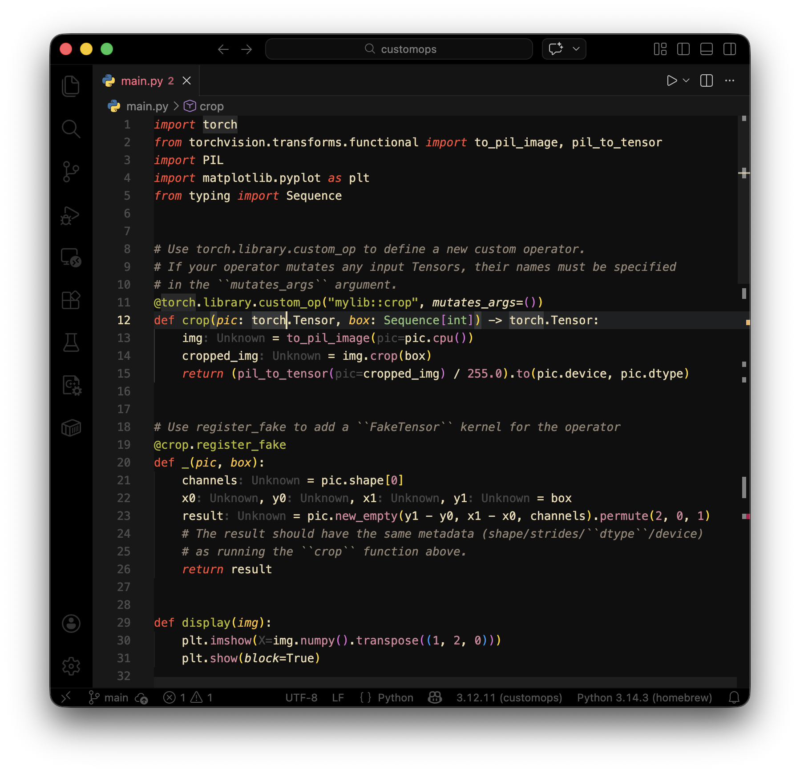
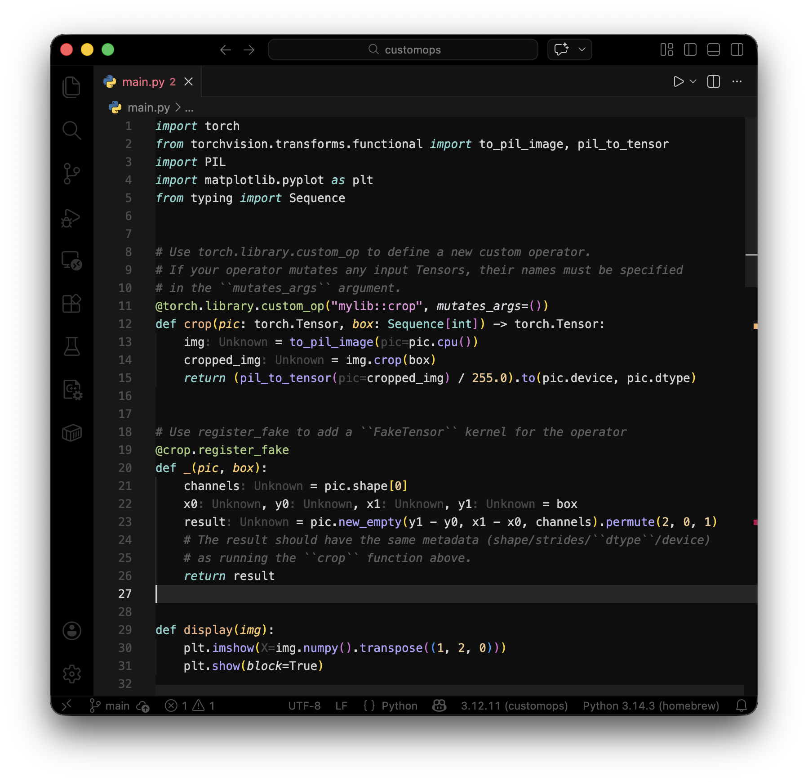

# vscode-color-themes

Personal VS Code / Cursor color themes.

## Example

### Gruvbox


### Cursor


## How to Build

Install [`vsce`](https://github.com/microsoft/vscode-vsce) if you haven't already:

```bash
npm install -g @vscode/vsce
```

Build a `.vsix` package from a theme directory:

```bash
cd cursor-sjk-gruvbox && vsce package
```

### Importing into VS Code / Cursor

1. Open the Command Palette (`Cmd+Shift+P` / `Ctrl+Shift+P`)
2. Run **Extensions: Install from VSIX...**
3. Select the generated `.vsix` file

## Credits & Licenses

- **Gruvbox** color palette by [Pavel Pertsev (morhetz)](https://github.com/morhetz/gruvbox), licensed under the [MIT License](https://github.com/morhetz/gruvbox/blob/master/LICENSE).
- **Cursor** editor by [Anysphere](https://cursor.com). Default theme colors and UI references are property of Anysphere Inc.
